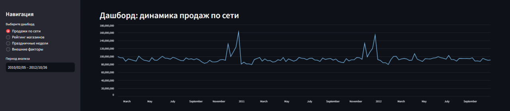
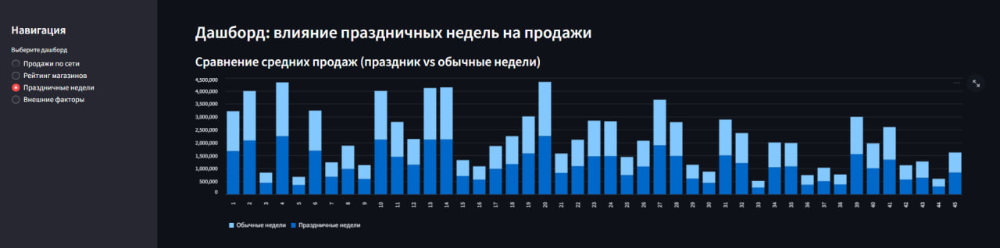
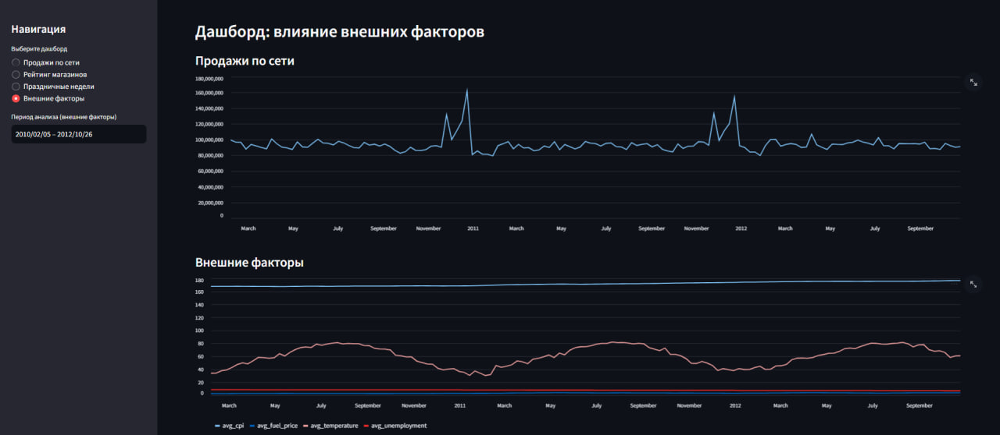

# Walmart Sales Analytics — ClickHouse + Streamlit Dashboard

Проект представляет собой аналитическую витрину и дашборды на основе исторических данных продаж Walmart.  
Используется ClickHouse как высокопроизводительное хранилище и Streamlit для визуализации ключевых бизнес-метрик.

---

## Цели проекта

- Построить аналитическую модель на основе исторических данных розничной сети.
- Сформировать аналитические витрины и SQL-запросы для анализа продаж.
- Реализовать интерактивные дашборды (Streamlit), доступные локально.
- Оценить влияние праздничных недель и внешних факторов на продажи.
- Построить рейтинг магазинов по выручке и средним продажам.

---

## Структура проекта
```
walmart-dashboards/
│
├── app.py # Streamlit-приложение (дашборды)
├── README.md
├── requirements.txt
├── config_example.yaml # конфигурация подключения к ClickHouse
│
├── data/
│ └── Walmart_Sales.csv # исходный датасет
│
├── sql/
│ ├── create_tables.sql # создание таблиц
│ ├── drop_tables.sql
│ ├── daily_sales.sql # витрина продаж по неделям
│ ├── holiday_impact.sql # сравнение праздничных/обычных недель
│ ├── store_ranking.sql # рейтинг магазинов
│ └── external_factors.sql # влияние температуры/топлива/CPI/безработицы
│
├── etl/
│ └── load_walmart_sales.py # загрузка CSV в ClickHouse
│
└── dashboards/
├── product_health.md # описание дашборда "Продажи по сети"
├── holiday_impact.md
├── store_ranking.md
└── external_factors.md
```


---

## Используемый стек

Python, ClickHouse, SQL, Streamlit, WSL, pandas, numpy, matplotlib

---

## Запуск проекта

### 1. Подготовка виртуального окружения

```
python3 -m venv venv
source venv/bin/activate
pip install -r requirements.txt
```

### 2. Запуск ClickHouse

```
sudo service clickhouse-server start
clickhouse-client
```

### 3. Загрузка данных Walmart в ClickHouse

```
python etl/load_walmart_sales.py
```

### 4. Запуск Streamlit-дашборда

```
streamlit run app.py
```

## Дашборды

### 1. Продажи по сети


### 2. Рейтинг магазинов


### 3. Праздничные недели


### 4. Внешние факторы

